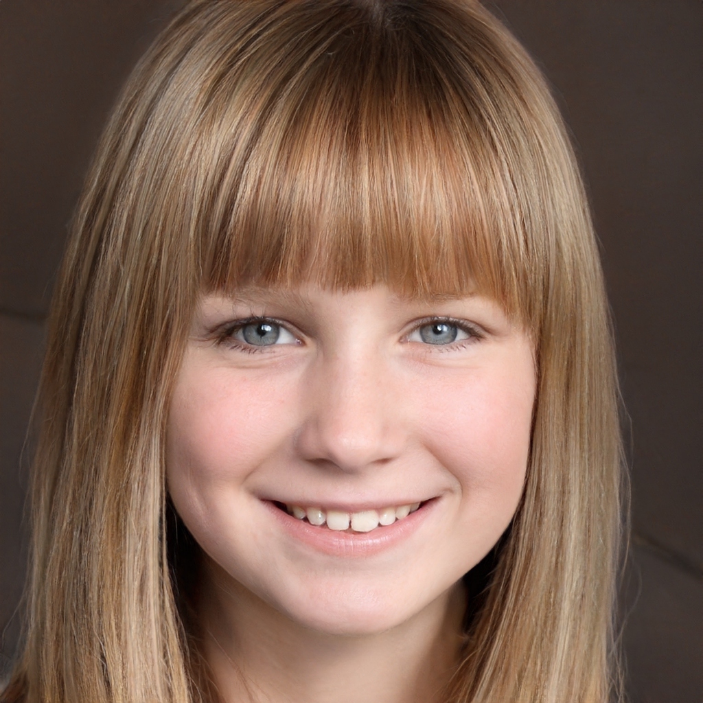
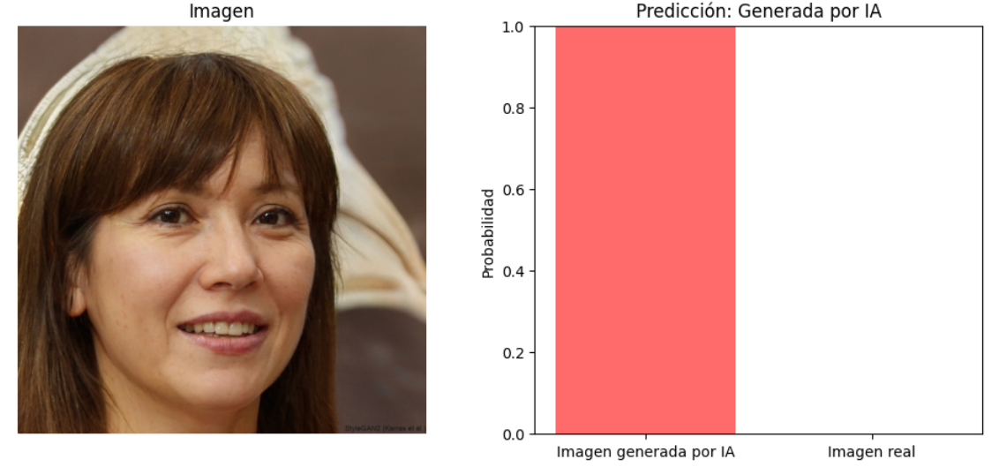
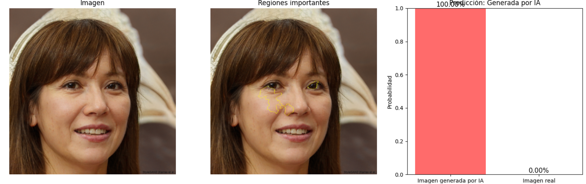

<h3 align="center">Detectando lo falso en un mundo generado por IA</h3>

  

    Los deepfake son una forma de inteligencia artificial que se utiliza para crear o manipular imágenes, vídeos o audios falsos de forma que parezcan reales. El término “deepfake” combina “deep learning” (aprendizaje profundo) con “fake” (falso), lo que refleja el uso de los algoritmos de deep learning en esta actividad <a href="https://www.fortinet.com/lat/resources/cyberglossary/deepfake">[1]</a><a href="https://www.proofpoint.com/es/threat-reference/deepfake">[2]</a>. A su vez, usan tecnologías avanzadas de machine learning (como las redes generativas adversariales o GAN) para generar contenido que sea difícil de identificar como no genuino <a href="https://www.lisainstitute.com/blogs/blog/deepfakes-tipos-consejos-riesgos-amenazas">[3]</a><a href="https://www.ismsforum.es/ficheros/descargas/deepfake-final1742458135.pdf">[4]</a>.
  

<!-- GETTING STARTED -->
## Datos

Para este proyecto en particular, utilizamos dos conjuntos de imágenes distintos: uno formado por fotos tomadas a <a href="https://susanqq.github.io/UTKFace/">personas reales</a> y otro con <a href="https://github.com/sejas/ai-StyleGAN2-faces/tree/master">imágenes creadas por StyleGan2</a>, una red adversarial generativa para la creación de imágenes. Presentamos dos imágenes, una de cada set, para ejemplificar lo difícil que puede ser diferenciar un rostro real de uno falso a primera vista. Ambas representan chicas de edades similares, y resulta casi imposible encontrar ninguna señal que indique que la joven de la derecha verdaderamente no existe.

  
  
  

Nuestro objetivo es estudiar como de viable es la creación de un modelo para la detección de deepfakes, y descubrir que aspectos de una imagen hacen que sea detectada como generada por IA.

(<a href="#readme-top">back to top</a>)
 

## Implementación

Dividimos el proyecto en cinco fases: descarga de imágenes, procesamiento de imágenes, diseño de los modelos, entrenamiento de los modelos, evaluación de los modelos y, finalmente, la aplicación al mundo real. Todo el código ha sido ejecutado en Google Collab, y el cuaderno Jupyter está disponible en este repositorio. 

  

El código está listo para ser ejecutado, ya que las imágenes serán descargadas desde unas carpetas compartidas en Google Drive. En caso de que las carpetas no estén disponibles, pueden ser descargadas desde sus respectivos propietarios, siguiendo las normas de licencia.

Ya que tanto la descarga de imágenes como el entrenamiento de los modelos requiere de mucho tiempo, se proporciona también todo el código ejecutado y archivos con los mejores pesos de los dos modelos pre-entrenados. De querer realizar alguna prueba con cualquiera de ellos, el archivo correspondiente puede ser subido al entorno y utilizado.

Finalmente, en el apartado de "Aplicaciones en el mundo real", se ofrece la oportunidad de probar la eficacia del modelo con imágenes seleccionadas por el usuario. Solo es necesario subir alguna imagen (real o no) recien creada carpeta "predicciones" y el resto del código se ocupa de las operaciones. También es posible conseguir la explicación de LIME para cada imagen, junto con su predicción, pero al tener mayor tiempo de ejecución se presenta en un bloque de código aparte, por si no se quiere ejecutarlo.

(<a href="#readme-top">back to top</a>)

<!-- USAGE EXAMPLES -->
## Usos

Mediante varias pruebas, hemos descubierto que contamos con un modelo muy fiable ante la detección de deepfakes u cualquier tipo de imágenes generadas por la Inteligencia Artificial. En el caso de este proyecto, ofrecemos una opción sencilla para probar el origen de imágenes seleccionadas por el usuario.

En cuanto aplicaciones de tecnologias para la protección contra deepfakes, las respuestas no se quedan cortas. La creación de los deepfake ha planteado nuevos desafíos técnicos, sociales y éticos. Este tipo de tecnologías han pasado de ser una herramienta de laboratorio a estar disponible para cualquier persona que tenga acceso a internet. Esta facilidad de acceso, combinada con la dificultad para distinguir contenido real del contenido manipulado, pone en peligro la confianza en la información visual, la privacidad de las personas, y la integridad de las plataformas.

En el contexto actual, donde las fake news, la suplantación de identidad y el fraude digital son cada vez más comunes, resulta necesario investigar métodos para distinguir el contenido real del generado artificialmente. Esta preocupación también está relacionada con la protección de los derechos individuales y la lucha contra la desinformación.

(<a href="#readme-top">back to top</a>)

<!-- LICENSE -->
## Licencias

Aquí se puede acceder a ambos datasets utilizados en el proyecto:

<a href="https://susanqq.github.io/UTKFace/">Dataset de imágenes reales</a>
 
<a href="https://github.com/sejas/ai-StyleGAN2-faces/tree/master">Dataset de imágenes generadas por StyleGan2</a>

(<a href="#readme-top">back to top</a>)

## Autoras
Universidad de Deusto
 
<a href="https://github.com/maren-gonzalez">Maren Gonzalez Garcia</a>
 
<a href="https://github.com/ainhoa-conde">Ainhoa Conde Basagutxibeaskoa</a>

